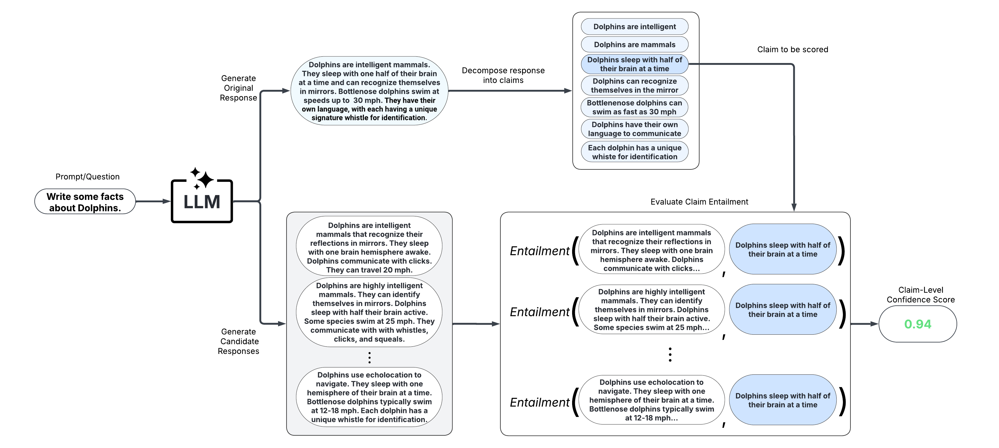
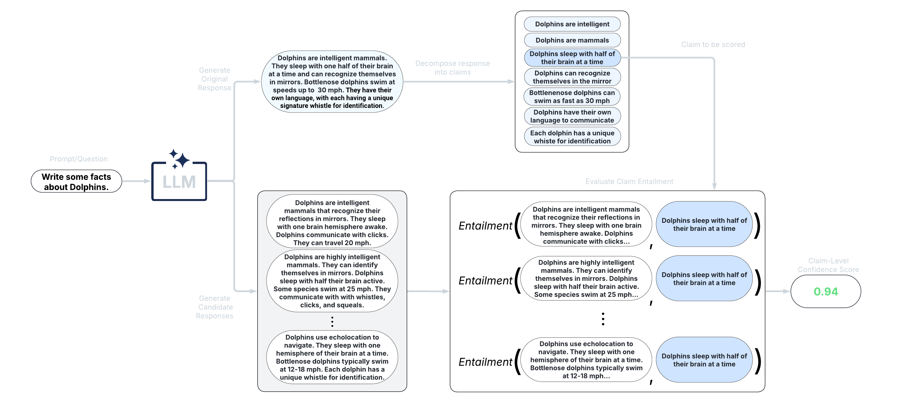
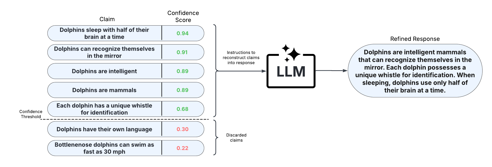
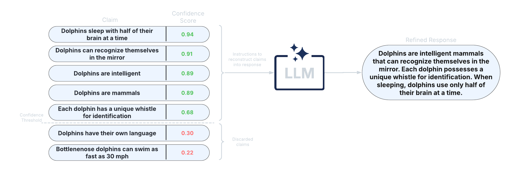

Quickstart Guide
================

Create a virtual environment for using uqlm
^^^^^^^^^^^^^^^^^^^^^^^^^^^^^^^^^^^^^^^^^^^

We recommend creating a new virtual environment using venv before installing the package. To do so, please follow instructions `here <https://docs.python.org/3/library/venv.html>`_.

Installation
^^^^^^^^^^^^

Install using pip directly from the GitHub repository.

.. code-block:: bash

   pip install uqlm

Scorer Types
------------

UQLM provides a suite of response-level scorers for quantifying LLM output uncertainty.
Each scorer returns a confidence score between 0 and 1, where higher scores indicate a lower likelihood of errors or hallucinations.
The five scorer categories differ in latency, cost, and compatibility:

.. list-table:: Comparison of Scorer Types
   :header-rows: 1
   :widths: 20 20 20 20 20

   * - Scorer Type
     - Added Latency
     - Added Cost
     - Compatibility
     - Off-the-Shelf / Effort
   * - :ref:`Black-Box Scorers <black-box-scorers>`
     - ⏱️ Medium-High (multiple generations & comparisons)
     - 💸 High (multiple LLM calls)
     - 🌍 Universal (works with any LLM)
     - ✅ Off-the-shelf
   * - :ref:`White-Box Scorers <white-box-scorers>`
     - ⚡ Minimal (token probabilities already returned)
     - ✔️ None (no extra LLM calls)
     - 🔒 Limited (requires access to token probabilities)
     - ✅ Off-the-shelf
   * - :ref:`LLM-as-a-Judge Scorers <llm-as-a-judge-scorers>`
     - ⏳ Low-Medium (additional judge calls add latency)
     - 💵 Low-High (depends on number of judges)
     - 🌍 Universal (any LLM can serve as judge)
     - ✅ Off-the-shelf; Can be customized
   * - :ref:`Ensemble Scorers <ensemble-scorers>`
     - 🔀 Flexible (combines various scorers)
     - 🔀 Flexible (combines various scorers)
     - 🔀 Flexible (combines various scorers)
     - ✅ Off-the-shelf (beginner-friendly); 🛠️ Can be tuned (best for advanced users)
   * - :ref:`Long-Text Scorers <long-text-scorers>`
     - ⏱️ High-Very high (multiple generations & claim-level comparisons)
     - 🔀 💸 High (multiple LLM calls)
     - 🔀 🌍 Universal
     - ✅ Off-the-shelf

.. _black-box-scorers:

1. Black-Box Scorers (Consistency-Based)
^^^^^^^^^^^^^^^^^^^^^^^^^^^^^^^^^^^^^^^^

.. image:: ./_static/images/black_box_graphic.png
   :class: only-light no-scaled-link responsive-img
   :align: center

.. image:: ./_static/images/black_box_graphic_dark.png
   :class: only-dark no-scaled-link responsive-img
   :align: center

These scorers assess uncertainty by measuring the consistency of multiple responses generated from the same prompt. They are compatible with any LLM, intuitive to use, and don't require access to internal model states or token probabilities.

  * Discrete Semantic Entropy (`Farquhar et al., 2024 <https://www.nature.com/articles/s41586-024-07421-0>`__; `Kuhn et al., 2023 <https://arxiv.org/pdf/2302.09664>`__)

  * Number of Semantic Sets (`Lin et al., 2024 <https://arxiv.org/abs/2305.19187>`__; `Vashurin et al., 2025 <https://arxiv.org/abs/2406.15627>`__; `Kuhn et al., 2023 <https://arxiv.org/pdf/2302.09664>`__)

  * Non-Contradiction Probability (`Chen & Mueller, 2023 <https://arxiv.org/abs/2308.16175>`__; `Lin et al., 2024 <https://arxiv.org/abs/2305.19187>`__; `Manakul et al., 2023 <https://arxiv.org/abs/2303.08896>`__)

  * Entailment Probability (`Chen & Mueller, 2023 <https://arxiv.org/abs/2308.16175>`__; `Lin et al., 2024 <https://arxiv.org/abs/2305.19187>`__; `Manakul et al., 2023 <https://arxiv.org/abs/2303.08896>`__)

  * Exact Match (`Cole et al., 2023 <https://arxiv.org/abs/2305.14613>`__; `Chen & Mueller, 2023 <https://arxiv.org/abs/2308.16175>`__)

  * BERT-score (`Manakul et al., 2023 <https://arxiv.org/abs/2303.08896>`__; `Zhang et al., 2020 <https://arxiv.org/abs/1904.09675>`__)

  * Cosine Similarity (`Shorinwa et al., 2024 <https://arxiv.org/pdf/2412.05563>`__; `HuggingFace <https://huggingface.co/sentence-transformers/all-MiniLM-L6-v2>`__)

Below is a minimal example using the ``BlackBoxUQ`` class:

.. code-block:: python

   from langchain_openai import ChatOpenAI
   llm = ChatOpenAI(model="gpt-4o-mini")

   from uqlm import BlackBoxUQ
   bbuq = BlackBoxUQ(llm=llm, scorers=["semantic_negentropy"], use_best=True)

   results = await bbuq.generate_and_score(prompts=prompts, num_responses=5)
   results.to_df()

.. raw:: html

   

     
   

``use_best=True`` implements mitigation so that the uncertainty-minimized response is selected. Any `LangChain Chat Model <https://js.langchain.com/docs/integrations/chat/>`__ may be used. For a more detailed demo refer to our `Black-Box UQ Demo <_notebooks/examples/black_box_demo.ipynb>`_, or see the :doc:`Black-Box Scorer Definitions <scorer_definitions/black_box/index>` for formal definitions.

.. _white-box-scorers:

2. White-Box Scorers (Token-Probability-Based)
^^^^^^^^^^^^^^^^^^^^^^^^^^^^^^^^^^^^^^^^^^^^^^

.. image:: ./_static/images/white_box_graphic.png
   :class: only-light no-scaled-link responsive-img
   :align: center

.. image:: ./_static/images/white_box_graphic_dark.png
   :class: only-dark no-scaled-link responsive-img
   :align: center

These scorers leverage token probabilities to estimate uncertainty. They offer single-generation scoring, which is significantly faster and cheaper than black-box methods, but require access to the LLM's internal probabilities. The following single-generation scorers are available:

  * Minimum token probability (`Manakul et al., 2023 <https://arxiv.org/abs/2303.08896>`__)

  * Length-Normalized Joint Token Probability (`Malinin & Gales, 2021 <https://arxiv.org/pdf/2002.07650>`__)

  * Sequence Probability (`Vashurin et al., 2024 <https://arxiv.org/abs/2406.15627>`__)

  * Mean Top-K Token Negentropy (`Scalena et al., 2025 <https://arxiv.org/abs/2510.11170>`__; `Manakul et al., 2023 <https://arxiv.org/abs/2303.08896>`__)

  * Min Top-K Token Negentropy (`Scalena et al., 2025 <https://arxiv.org/abs/2510.11170>`__; `Manakul et al., 2023 <https://arxiv.org/abs/2303.08896>`__)

  * Probability Margin (`Farr et al., 2024 <https://arxiv.org/abs/2408.08217>`__)

UQLM also offers sampling-based white-box methods with superior detection performance:

  * Monte Carlo Sequence Probability (`Kuhn et al., 2023 <https://arxiv.org/abs/2302.09664>`__)

  * Consistency and Confidence (CoCoA) (`Vashurin et al., 2025 <https://arxiv.org/abs/2502.04964>`__)

  * Semantic Entropy (`Farquhar et al., 2024 <https://www.nature.com/articles/s41586-024-07421-0>`__)

  * Semantic Density (`Qiu et al., 2024 <https://arxiv.org/abs/2405.13845>`__)

Lastly, the P(True) scorer is a self-reflection method requiring one additional generation per response:

  * P(True) (`Kadavath et al., 2022 <https://arxiv.org/abs/2207.05221>`__)

Below is a minimal example using the ``WhiteBoxUQ`` class:

.. code-block:: python

   from langchain_google_vertexai import ChatVertexAI
   llm = ChatVertexAI(model='gemini-2.5-pro')

   from uqlm import WhiteBoxUQ
   wbuq = WhiteBoxUQ(llm=llm, scorers=["min_probability"])

   results = await wbuq.generate_and_score(prompts=prompts)
   results.to_df()

.. raw:: html

   

     
   

Any `LangChain Chat Model <https://js.langchain.com/docs/integrations/chat/>`__ may be used in place of ``ChatVertexAI``. For a more detailed demo refer to our `White-Box UQ Demo <_notebooks/examples/white_box_demo.ipynb>`_, or see the :doc:`White-Box Scorer Definitions <scorer_definitions/white_box/index>` for formal definitions.

.. _llm-as-a-judge-scorers:

3. LLM-as-a-Judge Scorers
^^^^^^^^^^^^^^^^^^^^^^^^^

.. image:: ./_static/images/judges_graphic.png
   :class: only-light no-scaled-link responsive-img
   :align: center

.. image:: ./_static/images/judges_graphic_dark.png
   :class: only-dark no-scaled-link responsive-img
   :align: center

These scorers use one or more LLMs to evaluate the reliability of the original LLM's response. They offer high customizability through prompt engineering and the choice of judge LLM(s).

  * Categorical LLM-as-a-Judge (`Manakul et al., 2023 <https://arxiv.org/abs/2303.08896>`__; `Chen & Mueller, 2023 <https://arxiv.org/abs/2308.16175>`__; `Luo et al., 2023 <https://arxiv.org/pdf/2303.15621>`__)

  * Continuous LLM-as-a-Judge (`Xiong et al., 2024 <https://arxiv.org/pdf/2306.13063>`__)

  * Likert Scale Scoring (`Bai et al., 2023 <https://arxiv.org/pdf/2306.04181>`__)

  * Panel of LLM Judges (`Verga et al., 2024 <https://arxiv.org/abs/2404.18796>`__)

Below is a minimal example using the ``LLMPanel`` class:

.. code-block:: python

   from langchain_ollama import ChatOllama
   llama = ChatOllama(model="llama3")
   mistral = ChatOllama(model="mistral")
   qwen = ChatOllama(model="qwen3")

   from uqlm import LLMPanel
   panel = LLMPanel(llm=llama, judges=[llama, mistral, qwen])

   results = await panel.generate_and_score(prompts=prompts)
   results.to_df()

.. raw:: html

   

     
   

Any `LangChain Chat Model <https://js.langchain.com/docs/integrations/chat/>`__ may be used as judges. For a more detailed demo refer to our `LLM-as-a-Judge Demo <_notebooks/examples/judges_demo.ipynb>`_, or see the :doc:`LLM-as-a-Judge Scorer Definitions <scorer_definitions/llm_judges/index>` for formal definitions.

.. _ensemble-scorers:

4. Ensemble Scorers
^^^^^^^^^^^^^^^^^^^

.. image:: ./_static/images/uqensemble_generate_score.png
   :class: only-light no-scaled-link responsive-img
   :align: center

.. image:: ./_static/images/uqensemble_generate_score_dark.png
   :class: only-dark no-scaled-link responsive-img
   :align: center

These scorers leverage a weighted average of multiple individual scorers to provide a more robust uncertainty/confidence estimate. They offer high flexibility and customizability, allowing you to tailor the ensemble to specific use cases.

  * BS Detector (`Chen & Mueller, 2023 <https://arxiv.org/abs/2308.16175>`__)

  * Generalized Ensemble (`Bouchard & Chauhan, 2025 <https://arxiv.org/abs/2504.19254>`__)

Below is a minimal example using the ``UQEnsemble`` class:

.. code-block:: python

   from langchain_openai import AzureChatOpenAI
   llm = AzureChatOpenAI(deployment_name="gpt-4o", openai_api_type="azure", openai_api_version="2024-12-01-preview")

   from uqlm import UQEnsemble
   ## ---Option 1: Off-the-Shelf Ensemble---
   # uqe = UQEnsemble(llm=llm)
   # results = await uqe.generate_and_score(prompts=prompts, num_responses=5)

   ## ---Option 2: Tuned Ensemble---
   scorers = [ # specify which scorers to include
      "exact_match", "noncontradiction", # black-box scorers
      "min_probability", # white-box scorer
      llm # use same LLM as a judge
   ]
   uqe = UQEnsemble(llm=llm, scorers=scorers)

   # Tune on tuning prompts with provided ground truth answers
   tune_results = await uqe.tune(
      prompts=tuning_prompts, ground_truth_answers=ground_truth_answers
   )
   # ensemble is now tuned - generate responses on new prompts
   results = await uqe.generate_and_score(prompts=prompts)
   results.to_df()

.. raw:: html

   

     
   

Any `LangChain Chat Model <https://js.langchain.com/docs/integrations/chat/>`__ may be used in place of ``AzureChatOpenAI``. For more detailed demos refer to our `Off-the-Shelf Ensemble Demo <_notebooks/examples/ensemble_off_the_shelf_demo.ipynb>`_ (quick start) or `Ensemble Tuning Demo <_notebooks/examples/ensemble_tuning_demo.ipynb>`_ (advanced), or see the :doc:`Ensemble Scorer Definitions <scorer_definitions/ensemble/index>` for formal definitions.

.. _long-text-scorers:

5. Long-Text Scorers (Claim-Level)
^^^^^^^^^^^^^^^^^^^^^^^^^^^^^^^^^^

These scorers take a fine-grained approach and score confidence/uncertainty at the claim or sentence level. An extension of black-box scorers, long-text scorers sample multiple responses to the same prompt, decompose the original response into claims or sentences, and evaluate consistency of each original claim/sentence with the sampled responses.

After scoring claims in the response, the response can be refined by removing claims with confidence scores less than a specified threshold and reconstructing the response from the retained claims. This approach allows for improved factual precision of long-text generations.

  * LUQ scorers (`Zhang et al., 2024 <https://arxiv.org/abs/2403.20279>`__; `Zhang et al., 2025 <https://arxiv.org/abs/2410.13246>`__)

  * Graph-based scorers (`Jiang et al., 2024 <https://arxiv.org/abs/2410.20783>`__)

  * Generalized long-form semantic entropy (`Farquhar et al., 2024 <https://www.nature.com/articles/s41586-024-07421-0>`__)

Below is a minimal example using the ``LongTextUQ`` class:

.. code-block:: python

    from langchain_openai import ChatOpenAI
    llm = ChatOpenAI(model="gpt-4o")

    from uqlm import LongTextUQ
    luq = LongTextUQ(llm=llm, scorers=["entailment"], response_refinement=True)

    results = await luq.generate_and_score(prompts=prompts, num_responses=5)
    results_df = results.to_df()
    results_df

    # Preview the data for a specific claim in the first response
    # results_df["claims_data"][0][0]
    # Output:
    # {
    #   'claim': 'Suthida Bajrasudhabimalalakshana was born on June 3, 1978.',
    #   'removed': False,
    #   'entailment': 0.9548099517822266
    # }

.. raw:: html

   

     
   

``response`` and ``entailment`` reflect the original response and response-level confidence score, while ``refined_response`` and ``refined_entailment`` are the corresponding values after response refinement. The ``claims_data`` column includes granular data for each response, including claims, claim-level confidence scores, and whether each claim is retained. Any `LangChain Chat Model <https://js.langchain.com/docs/integrations/chat/>`__ may be used. For a more detailed demo refer to our `Long-Text UQ Demo <_notebooks/examples/long_text_uq_demo.ipynb>`_, or see the :doc:`Long-Text Scorer Definitions <scorer_definitions/long_text/index>` for formal definitions.

Example notebooks
-----------------
Refer to our :doc:`example notebooks <_notebooks/index>` for examples illustrating how to use `uqlm`.
